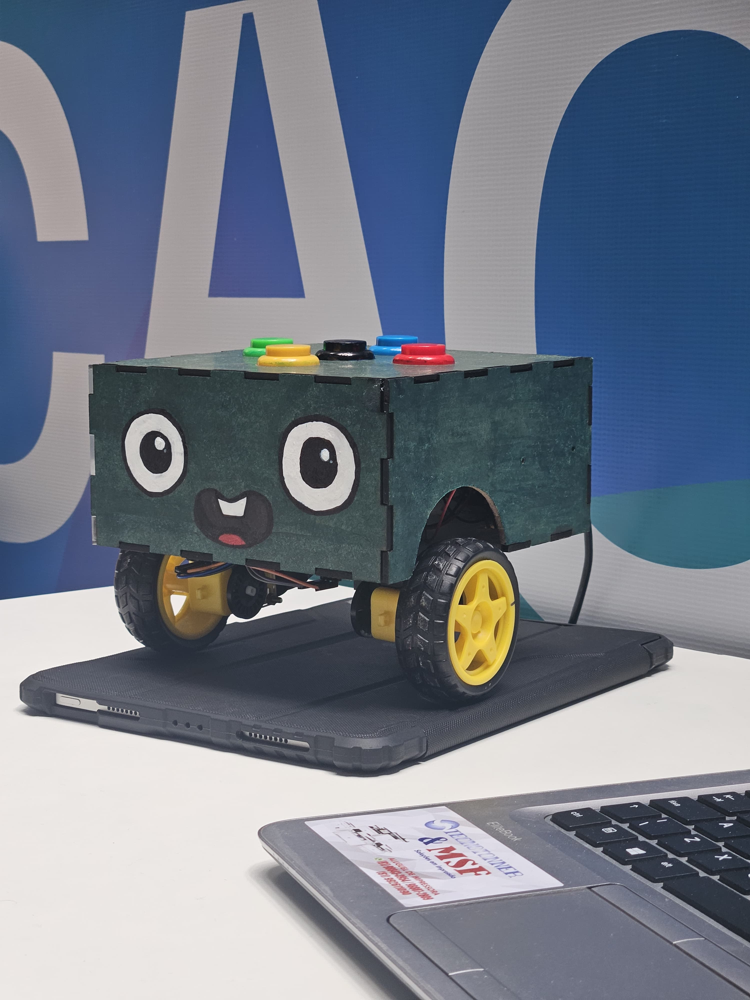

# FRAME - Robótica Educacional & Cultura Maker 🤖🎓

> **F**ramework **R**obótico para **A**prendizado **M**aker e **E**ducacional

O **FRAME** é um projeto desenvolvido pelo **Grupo Arquimedes** com o objetivo de democratizar o ensino de robótica e pensamento computacional em escolas públicas. Nossa solução combina tecnologia de baixo custo (Arduino, impressão 3D/MDF) com uma abordagem pedagógica "desplugada" e fortemente enraizada na cultura pernambucana.



## 🎯 Sobre o Projeto

O FRAME nasceu da necessidade de mitigar barreiras pedagógicas no uso de tecnologia em sala de aula. Diferente de soluções comerciais "caixa-preta" e caras, o FRAME é uma **tecnologia aberta, reparável e financeiramente viável**.

O aprendizado acontece sobre um tapete temático do Recife, onde crianças programam os movimentos do robô (frente, trás, esquerda, direita) através de botões táteis no próprio chassi, navegando por ícones da nossa cultura como o Galo da Madrugada e o Manguebeat.

## ✨ Principais Características

*   **Programação Desplugada:** Ensina lógica e sequenciamento sem necessidade de computadores ou telas individuais para os alunos.
*   **Identidade Cultural:** Tapetes pedagógicos temáticos que conectam tecnologia à geografia e história local (Recife/PE).
*   **Hardware Acessível:** Baseado em Arduino, com estrutura em MDF e materiais recicláveis, facilitando a manutenção e replicação.
*   **Foco no Fundamental I:** Projetado ergonomicamente e pedagogicamente para crianças nos primeiros anos escolares.

## 🛠️ Tecnologias Utilizadas

Este repositório contém o código fonte da **Landing Page** do projeto, desenvolvida para apresentar a iniciativa e disponibilizar os documentos técnicos.

*   **Frontend:** [React](https://reactjs.org/)
*   **Build Tool:** [Vite](https://vitejs.dev/)
*   **Estilização:** [Tailwind CSS](https://tailwindcss.com/)
*   **Animações:** [Framer Motion](https://www.framer.com/motion/)
*   **Ícones:** [Lucide React](https://lucide.dev/)

## 🚀 Como Executar o Projeto

Siga os passos abaixo para rodar a landing page em sua máquina local:

### Pré-requisitos
*   Node.js (versão 16 ou superior)
*   npm (gerenciador de pacotes)

### Instalação

1.  **Clone o repositório:**
    ```bash
    git clone https://github.com/Icaro-Costa/FRAME.git
    cd FRAME
    ```

2.  **Instale as dependências:**
    ```bash
    npm install
    ```

3.  **Inicie o servidor de desenvolvimento:**
    ```bash
    npm run dev
    ```

4.  Acesse `http://localhost:5173` no seu navegador.

## 👥 A Equipe (Grupo Arquimedes)

Uma equipe multidisciplinar unida pela paixão por tecnologia e educação:

*   **Sammuel Victor** - Liderança Técnica & Pedagógica
*   **Icaro Costa** - Desenvolvedor & Maker
*   **Beatriz Sales** - Design & Prototipagem
*   **Lucas Pires** - Maker & Design
*   **Lívia Ariane** - Pedagogia
*   **Ystefani** - Ideação

## 📄 Documentação

Os documentos completos do projeto (Relatório Técnico, Apresentação e Ideação) estão disponíveis para download diretamente na seção "Docs" da landing page.

## 📩 Contato

*   **E-mail:** [icaro.developerr@gmail.com](mailto:icaro.developerr@gmail.com)
*   **GitHub:** [Icaro-Costa](https://github.com/Icaro-Costa)

---

Desenvolvido com 🧡 em Recife, PE.
